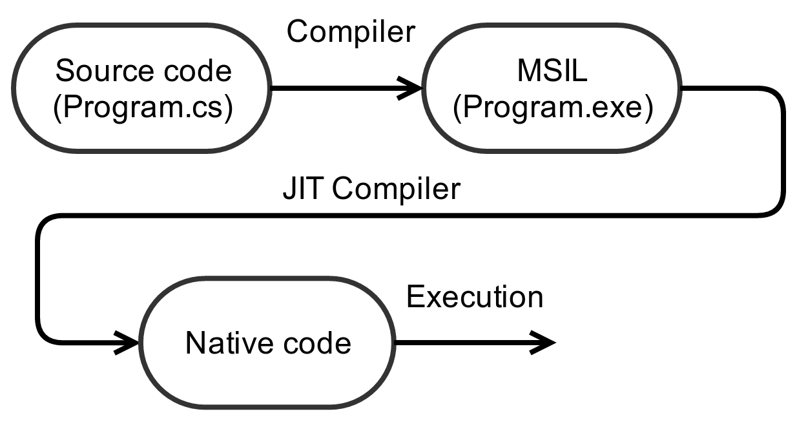

\titlepage

## Overview
\tableofcontents


# Introduction

## History

## Characteristics

> - Strongly typed
> - Imperative, procedural
> - Object oriented
> - Object oriented
> - OBJECT ORIENTED

## Classic compilation


## C# compilation

> - Use of an intermediate language
> - MSIL (MicroSoft Intermediate Language)
> - JIT (Just In Time) compiler
> - Slower than C++
> - Faster than Java

## C# compilation



## .NET

shepard

# Syntax

## Types

shepard


# Questions?


# Object Oriented Programming

## What is OOP ?

> - New way of thinking
> - Existence of patterns
> - Create objects from these patterns
> - Make these objects interact

## Classes

```cs
class Window
{
  int width;
  int height;
  float opacity;
  bool hasShutter;
  [...]
}
```

## Classes

```cs
class Meven
{
  int height; // Pretty small
  Color eyesColor;

  // Methods
  public string getName();
  public void Work();
  public void Sleep();
  public bool isTired();
  [...]
  private void getNaked();
}

```

## Classes

> - How do I create an object ?
> - Use the keyword `new`
> - `new` is used with class constructor

## Classes

```cs
public void main()
{
  Meven meven = new Meven();
  // Then you can call meven's methods
  
  if (!meven.isTired())
    meven.Work();
  else
    meven.Work();
}

```

## Classes

> - What is a class constructor ?
> - Instanciate a new object
> - Pass parameters along with it
> - You can have several constructors per class
> - Default constructor given if not specified

## Visibility

reaper

## Inheritence

reaper


# Advanced C\#

## Namespaces

mevouc

## Operators overloading

mevouc

## Genericity

## Functionnal programming

> - Function types
> - Function values
> - Function arithmetic
> - LINQ


# Questions?
